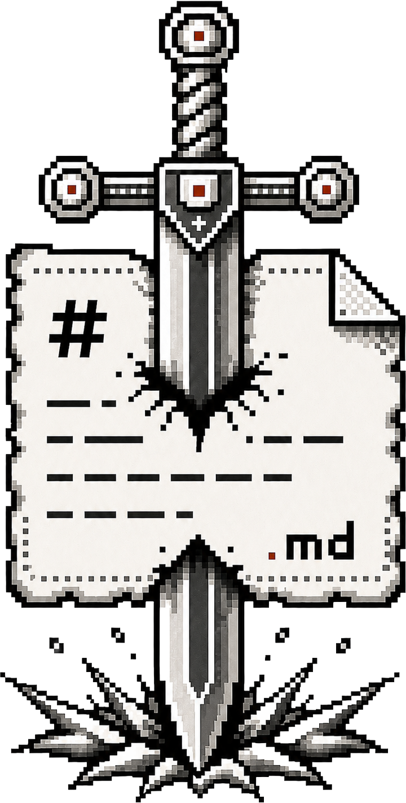

<p align="center">
  
</p>

# CONFESSIONS.txt
### Proof of Omertà
*Research & development*

CONFESSIONS.txt is a local-first CLI and static verifier for producing cryptographically sealed testimony artifacts.

The protocol packages a plaintext testimony file, encrypts it with `age` into `payload.age`, embeds that ciphertext into a carrier image with HStego, uploads the locked artifact to Arweave through ArDrive, and generates Base calldata so the artifact can be publicly referenced and later audited.

Primary use cases include sealed whistleblower disclosures, survivor recordkeeping, delayed-release testimony, and other workflows where an operator needs a durable public pointer without publishing plaintext.

Verifier: **https://confessionstxt.art/verify**

## Protocol summary

1. **Record**: write testimony as plaintext (`.md`, `.txt`, or similar).
2. **Pack**: archive the file into `payload.tar.gz` so the original filename survives.
3. **Seal**: encrypt the archive with `age` to produce `payload.age`.
4. **Conceal**: embed `payload.age` into a carrier image with HStego.
5. **Archive**: upload the locked artifact to Arweave through ArDrive.
6. **Broadcast**: generate Base calldata containing the artifact pointer and integrity hash.

**Canonical integrity value**

- `CSHA = sha512(payload.age)`

The integrity hash is over the encrypted payload, not the plaintext archive.

## Outputs

- `payload.age` - encrypted payload produced by `age`
- `locked_artifact.jpg` - carrier image containing the encrypted payload
- `CSHA` - SHA-512 checksum over `payload.age`
- Base calldata from `mint` - operator-broadcast metadata reference

Steganography is treated as concealment and transport. Confidentiality comes from `age`.

## On-chain metadata

`mint` builds a human-readable metadata label and prints the corresponding calldata:

```text
TITLE | ARTXID:<ARWEAVE_TXID> | CSHA:<SHA512>
TITLE | ARTXID:<ARWEAVE_TXID> | CSHA:<SHA512> | STEG:<VALUE>
```

- `ARTXID` points to the Arweave artifact
- `CSHA` is the canonical verification value
- `STEG` is optional and makes extraction public if included

The Base transaction is the pointer layer. The artifact itself lives on Arweave. The plaintext testimony stays local unless the operator chooses to disclose it.

## Public vs private surfaces

What can become public:

- the locked artifact on Arweave
- the Base metadata label
- the stego extraction secret if `STEG` is published on-chain

What remains private by default:

- the plaintext testimony file
- the `age` passphrase
- the stego passphrase, unless published as `STEG`

## Password modes

`seal` supports two modes:

- **Split-pass mode**
  - custom: `--age-pass "<AGE_PASS>" --stego-pass "<STEGO_PASS>"`
  - generated: `--gen-split-pass`
- **Single-pass mode**
  - custom: `--single-pass "<PASS>"`
  - generated: `--gen-single-pass`

Operational difference:

- split mode separates extraction from decryption
- single-pass mode binds extraction and decryption to one secret

In split mode, `--stego-pass` can be shared to allow extraction of `payload.age` and checksum verification without disclosing the `--age-pass` required for decryption.

## Security model

- **Local-first**: plaintext remains on the operator's machine unless intentionally disclosed.
- **No wallet custody in the CLI**: `mint` only prints calldata. The operator signs and broadcasts manually from their own wallet.
- **Defense in depth**: if embedding is detected, `payload.age` is still encrypted.
- **Public verifiability**: anyone with the artifact and the correct extraction path can verify `CSHA`.
- **Experimental**: this is R&D software, not a complete safety plan or a substitute for legal, medical, or security advice.

Notes:

- no stego method is guaranteed undetectable
- embedding capacity is payload-rate constrained by cover image size and format
- recommended wallet for manual calldata broadcast: **Rabby**

## Repository

- `cli/confess.py` - CLI for sealing, uploading, extracting, and verifying artifacts
- `cli/confess` - small entry wrapper for the CLI
- `web/` - static site and browser verifier deployed at `confessionstxt.art`
- `scripts/install_hstego_mac.sh` - macOS helper for building HStego with JPEG support

## Prerequisites

- Python **3.11 / 3.12** recommended
- `age`
- HStego with native JPEG support
- `ardrive` CLI
- optional: `ssss-split` for Shamir secret splitting

Check the environment with:

```bash
python3 cli/confess.py doctor
```

## Install

### macOS

```bash
xcode-select --install
brew install python@3.12 age jpeg

$(brew --prefix python@3.12)/bin/python3.12 -m venv .venv
source .venv/bin/activate
python -m pip install --upgrade pip

python -m pip install imageio numpy scipy pycryptodome numba Pillow
bash scripts/install_hstego_mac.sh

npm install -g ardrive-cli
```

### Ubuntu

```bash
sudo apt-get update
sudo apt-get install -y age python3-pip build-essential libjpeg-dev python3-tk

python3 -m venv .venv
source .venv/bin/activate
python -m pip install --upgrade pip

python -m pip install imageio numpy scipy pycryptodome numba Pillow
python -m pip install git+https://github.com/daniellerch/hstego.git@v0.5

npm install -g ardrive-cli
```

## Quickstart

### 1. Run diagnostics

```bash
python3 cli/confess.py doctor
```

### 2. Store your Arweave wallet path

```bash
python3 cli/confess.py init
```

`init` stores the selected wallet path in `.confess/config.json`.

### 3. Seal a testimony

Generated split-pass mode:

```bash
python3 cli/confess.py seal --image cover.jpg --text confession.md --gen-split-pass
```

Manual split-pass mode:

```bash
python3 cli/confess.py seal --image cover.jpg --text confession.md --split-pass-prompt
```

Single-pass mode:

```bash
python3 cli/confess.py seal --image cover.jpg --text confession.md --gen-single-pass
```

Typical outputs:

- `payload.age`
- `locked_artifact.jpg`
- `CSHA`

### 4. Create or identify an ArDrive destination

Example:

```bash
ardrive create-drive --wallet-file /path/to/wallet.json --drive-name "CONFESSIONS"
```

For `confess.py push --folder-id`, use the folder `entityId` from the `created[]` item where `type == "folder"`.

Do not use:

- the drive `entityId`
- `metadataTxId`
- `bundleTxId`

If the drive already exists and the folder `entityId` is not saved, list the drive contents and reuse the target folder `entityId`.

### 5. Upload the locked artifact

```bash
python3 cli/confess.py push --file locked_artifact.jpg --folder-id <ARDRIVE_FOLDER_ENTITY_ID>
```

Outputs:

- Arweave TXID
- `https://arweave.net/<TXID>`

### 6. Generate Base calldata

```bash
python3 cli/confess.py mint --title "Proof of Omertà" --txid <ARWEAVE_TXID> --csha <CSHA_SHA512>
```

Optional public extraction:

```bash
python3 cli/confess.py mint --title "Proof of Omertà" --txid <ARWEAVE_TXID> --csha <CSHA_SHA512> --steg "<STEGO_PASS>"
```

Publishing `STEG` makes extraction of `payload.age` public. Keep it private unless public extraction is intentional.

`mint` prints:

- the metadata string
- the `0x...` calldata to paste into the transaction input field

Manual broadcast settings:

- network: Base
- send: `0 ETH`
- to: null address or self
- data: paste the printed calldata

## Verification

### Browser verifier

Use the public verifier:

**https://confessionstxt.art/verify**

It resolves:

- Base transaction metadata
- linked Arweave artifact
- image preview and protocol record

### Local verification

Extract the encrypted payload:

```bash
python3 cli/confess.py extract --image locked_artifact.jpg --stego-pass-prompt
```

Verify the checksum:

```bash
python3 cli/confess.py verify --file payload.age --csha <CSHA_SHA512>
```

Decrypt after a successful checksum match:

```bash
python3 cli/confess.py verify --file payload.age --csha <CSHA_SHA512> --decrypt --age-pass-prompt
```

## Command reference

- `python3 cli/confess.py --help` - print expanded help for all subcommands
- `doctor` - check dependencies and print install hints
- `init` - store Arweave wallet path and attempt address/balance lookup
- `seal` - package, encrypt, and embed a testimony file
- `push` - upload a locked artifact through ArDrive
- `mint` - generate Base calldata from title, TXID, and CSHA
- `extract` - recover `payload.age` from a locked artifact
- `verify` - compare `payload.age` against `CSHA` and optionally decrypt

## Operational notes

- `.confess/config.json` is local configuration and should remain out of version control.
- Prefer `--*-prompt` flags for manual secrets. Literal passphrase flags can be visible in shell history and process lists.
- Commands refuse to overwrite generated outputs unless `--force` is supplied.
- First HStego runs can be slow because of native build and JIT overhead.
- If embedding fails, use a larger cover image or reduce payload size.
- If `STEG` is published, anyone can extract `payload.age` from the public artifact, but plaintext still requires the `age` passphrase.
- The website verifier is static and does not require a backend.
