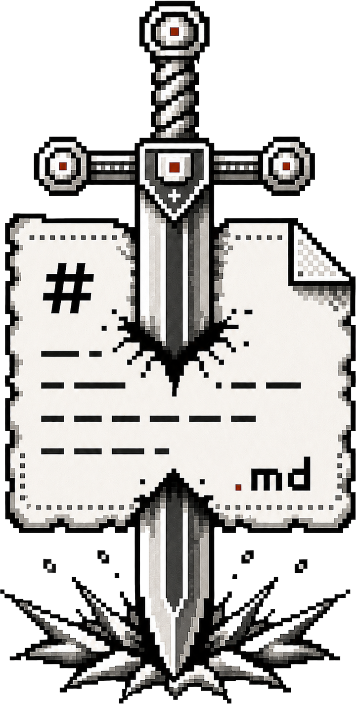

<p align="center">
  
</p>

# CONFESSIONS.txt

### Proof of Omertà

**Put a secret in a picture. Leave a public record that it exists. Choose later whether anyone gets to read it.**

CONFESSIONS.txt is a personal art project for making encrypted confessions. You write a text file, seal it on your own computer, and hide the encrypted file inside an image. You can keep that image to yourself or publish it with a permanent public reference.

The public record lets someone check that they recovered the same encrypted file you originally published. Reading the confession still requires its private password. The record proves neither who wrote it nor whether its contents are true.

There is no account and no hosted service that receives your text or decrypts it. A guided terminal menu walks you through the process; the [public verifier](https://confessionstxt.art/verify) looks up published records.

## How a record works

1. **Write** your confession in a local text file and choose a cover image.
2. **Seal** it: the app packs the text into an archive, encrypts it with age, and hides the encrypted file inside the image with HStego.
3. **Keep or publish** the image. Optional publication stores it on Arweave and records its location and encrypted-file checksum on Base.
4. **Verify or read** it later: extract the encrypted file and compare its checksum with the public record or your saved checksum. Reading the text requires the separate AGE password.

## Start here

The tested setup is **macOS on Apple Silicon**, with Homebrew and Xcode Command Line Tools installed:

```bash
git clone https://github.com/arjanflac/confessions.txt.git
cd confessions.txt
bash scripts/bootstrap_mac.sh
./confess
```

The launcher uses the project's Python environment automatically. The menu is a simple numbered interface that works in an ordinary terminal. You can seal, extract, check, and decrypt a record without a wallet or any funds.

Use a **separate private folder for each record**, outside cloud sync. Run the launcher by its absolute path from that folder, and enter the paths to your cover image and text file when prompted. Keep your original text and cover image.

The menu can:

- **Seal** a text file inside a JPEG or PNG, with two strong random passwords by default (`seal`).
- **Extract** the encrypted file from an image (`extract`).
- **Check** its checksum and optionally decrypt it locally (`verify`).
- **Look up** a public reference with Node.js 22 or newer installed.
- **Publish** the image to Arweave after a separate confirmation (`push`), or prepare transaction data for Base (`mint`).
- **Check setup** (`doctor`) and configure a wallet when you need one (`init`).

It remembers the current artifact and checksum while it is open. Ctrl-C cancels the current step; at the main menu it exits. Existing files are protected from accidental overwrites.

The menu and individual commands use the same code. Run `./confess --help` to see all commands, or `./confess seal --help` for one step's options. The [terminal reference](docs/cli.md) has complete command examples, advanced setup, and legacy-record instructions.

## What sealing creates

| File | Purpose | Keep private? |
| --- | --- | --- |
| `locked_artifact.jpg` or `.png` | Your image, containing the encrypted confession | Until you choose to publish it |
| `payload.age` | The encrypted file hidden in the image | Can be public with a strong independent AGE password |
| `locked_artifact.secrets.json` | The two generated passwords | **Yes — this file is plaintext** |

Old records remain readable: choose legacy extraction in the menu for images created with HStego v0.5. New seals use the updated authenticated HStego format.

The terminal also prints **CSHA**, the SHA-512 checksum of `payload.age`. Keep it with the record. Sealing extracts the finished image and checks this checksum before saving the outputs.

Save both passwords in a password manager. The **STEG password** opens the hiding place in the image. The **AGE password** unlocks the text. If you intentionally publish STEG, other people can extract the encrypted file and check it while the confession stays encrypted.

**Never publish the AGE password, or publish STEG from an old record that used one password for both layers.** There is no password reset or recovery service. Losing the AGE password can make your confession permanently unreadable.

## Publishing is optional, and permanent

The image can be uploaded to **Arweave** using ArDrive and your own funded wallet. The menu asks you to type `UPLOAD` before doing this. It then helps you prepare a **Base** transaction containing the image's location, its CSHA, and optionally its public STEG password. You review, sign, and send the Base transaction yourself; the app only prepares the data.

Arweave uploads and on-chain data cannot reliably be taken back. Check the exact image, title, checksum, and any public password before publishing. Wallet transactions can link the record to you.

Download the original image from Arweave for extraction. Social platforms often resize or recompress images, which can destroy the hidden payload.

## Look up a public record

Open the [web verifier](https://confessionstxt.art/verify), or use the read-only npm verifier with Node.js 22 or newer:

```bash
npx -y @confessionstxt/cli@latest verify <BASE_TX_HASH>
```

The npm package also provides a [read-only MCP server](packages/cli/README.md). It handles public references and metadata; local sealing and decryption stay in `./confess`.

**“Metadata Resolved” is a lookup result.** It does not mean the browser has extracted the hidden file, checked its CSHA, or read the confession. To verify the payload, download the original image and use the terminal menu to extract it and compare its checksum with the public record.

## Security, plainly

Confidentiality comes from **[age](https://age-encryption.org/)** encryption. **HStego** hides and transports the encrypted file; hiding is not a promise that nobody can detect it. Generated passwords use 32 random bytes each. Guessing an independently generated password of that size is not a realistic attack, but a leaked password or compromised computer bypasses that protection.

This is experimental software, not an anonymity system or a professionally certified security product. Public RPCs, gateways, dependencies, your operating system, and your handling of the passwords remain part of the trust model. Read the [security model and limits](docs/security.md) before using it for sensitive material.

## Details and development

- [Command reference and advanced setup](docs/cli.md) — the same operations remain scriptable.
- [Public protocol](web/protocol.md) — metadata format and proof boundaries.
- [npm verifier and MCP](packages/cli/README.md) — integrations for public records.
- [Release readiness](docs/release-readiness.md) — checks, deployment behavior, and remaining caveats.
- [Changelog](CHANGELOG.md).

```bash
npm --prefix packages/cli ci --ignore-scripts
npm --prefix packages/cli test
.venv/bin/python -m unittest discover -s tests
# Optional real age/HStego round trips, using synthetic text only:
CONFESS_NATIVE_TESTS=1 .venv/bin/python -m unittest discover -s tests

node scripts/check_package.mjs
```

**CripTech**
